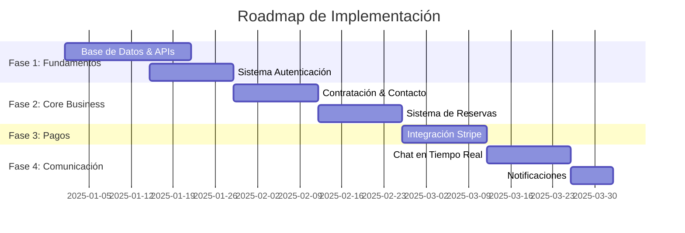

# 🚀 ROADMAP DE IMPLEMENTACIÓN - PLATAFORMA DE TRABAJO

**Documento:** Plan de Desarrollo para Funcionalidad Completa  
**Basado en:** Auditoría Integral de Componentes No Funcionales  
**Objetivo:** Transformar prototipo en plataforma funcional completa

---

## 📊 ANÁLISIS DE PRIORIDADES

### 🎯 MATRIZ DE IMPACTO vs ESFUERZO

| **FUNCIONALIDAD** | **IMPACTO NEGOCIO** | **ESFUERZO TÉCNICO** | **PRIORIDAD** |
|-------------------|---------------------|----------------------|---------------|
| Sistema de Autenticación | 🔴 CRÍTICO | 🟡 MEDIO | **P1** |
| Base de Datos & APIs | 🔴 CRÍTICO | 🔴 ALTO | **P1** |
| Contratación/Contacto | 🔴 CRÍTICO | 🟡 MEDIO | **P1** |
| Sistema de Pagos | 🔴 CRÍTICO | 🔴 ALTO | **P2** |
| Reserva de Servicios | 🟠 ALTO | 🟡 MEDIO | **P2** |
| Chat/Mensajería | 🟠 ALTO | 🔴 ALTO | **P2** |
| Notificaciones | 🟡 MEDIO | 🟡 MEDIO | **P3** |
| Panel de Configuración | 🟡 MEDIO | 🟢 BAJO | **P3** |

---

## 🏗️ FASES DE DESARROLLO

### **FASE 1: FUNDAMENTOS TÉCNICOS** ⚡ (Semanas 1-3)
*Establecer la infraestructura base para funcionalidad real*

#### 1.1 **Base de Datos y Esquemas**
```sql
-- Esquemas principales a implementar
CREATE TABLE users (
  id UUID PRIMARY KEY,
  email VARCHAR UNIQUE NOT NULL,
  role ENUM('professional', 'client', 'admin'),
  profile_data JSONB,
  created_at TIMESTAMP
);

CREATE TABLE professionals (
  id UUID PRIMARY KEY,
  user_id UUID REFERENCES users(id),
  skills TEXT[],
  hourly_rate DECIMAL,
  availability JSONB,
  verification_status ENUM('pending', 'verified', 'rejected')
);

CREATE TABLE services (
  id UUID PRIMARY KEY,
  professional_id UUID REFERENCES professionals(id),
  title VARCHAR NOT NULL,
  description TEXT,
  price DECIMAL,
  category VARCHAR,
  is_active BOOLEAN DEFAULT true
);
```

#### 1.2 **API Backend (Next.js API Routes)**
```typescript
// Estructura de APIs a implementar
/api/auth/          // Autenticación y autorización
/api/professionals/ // CRUD profesionales
/api/services/      // CRUD servicios
/api/bookings/      // Sistema de reservas
/api/payments/      // Integración pagos
/api/messages/      // Sistema mensajería
```

#### 1.3 **Sistema de Autenticación**
- **Framework:** NextAuth.js con providers múltiples
- **Funciones:** Registro, login, verificación email, roles
- **Seguridad:** JWT tokens, middleware protección rutas

---

### **FASE 2: FUNCIONALIDADES CORE** 🎯 (Semanas 4-6)
*Implementar funciones críticas de negocio*

#### 2.1 **Contratación y Contacto**
**Archivos a modificar:**
- `src/app/professionals/[id]/page.tsx`
- `src/components/professional/contact-form.tsx` (nuevo)

```typescript
// ✅ IMPLEMENTACIÓN FUNCIONAL
const handleContactProfessional = async (formData: ContactFormData) => {
  try {
    const response = await fetch('/api/messages/send', {
      method: 'POST',
      headers: { 'Content-Type': 'application/json' },
      body: JSON.stringify({
        to_professional_id: professionalId,
        message: formData.message,
        contact_type: 'inquiry',
        project_details: formData.projectDetails
      })
    });
    
    if (response.ok) {
      toast.success('Mensaje enviado correctamente');
      setShowContactForm(false);
    }
  } catch (error) {
    toast.error('Error al enviar mensaje');
  }
};
```

#### 2.2 **Sistema de Reservas**
**Archivos a modificar:**
- `src/app/services/[id]/page.tsx`
- `src/shared/hooks/useBookings.ts`
- `src/components/booking/booking-modal.tsx` (nuevo)

```typescript
// ✅ HOOK FUNCIONAL
export const useBookings = () => {
  const createBooking = async (bookingData: BookingData) => {
    const response = await fetch('/api/bookings', {
      method: 'POST',
      body: JSON.stringify(bookingData)
    });
    return response.json();
  };
  
  const getBookings = async (userId: string) => {
    const response = await fetch(`/api/bookings/user/${userId}`);
    return response.json();
  };
  
  return { createBooking, getBookings };
};
```

#### 2.3 **Gestión de Datos Dinámicos**
**Reemplazar datos mock:**
- `src/shared/constants/index.ts` → Llamadas API reales
- `src/app/professionals/page.tsx` → Paginación y filtros reales
- `src/app/services/page.tsx` → Búsqueda dinámica

---

### **FASE 3: PAGOS Y TRANSACCIONES** 💳 (Semanas 7-8)
*Sistema de pagos seguro y completo*

#### 3.1 **Integración Stripe**
```bash
npm install stripe @stripe/stripe-js
```

```typescript
// src/lib/stripe.ts
import Stripe from 'stripe';

export const stripe = new Stripe(process.env.STRIPE_SECRET_KEY!, {
  apiVersion: '2023-10-16',
});

// Función para crear intención de pago
export const createPaymentIntent = async (amount: number, currency = 'usd') => {
  return await stripe.paymentIntents.create({
    amount: amount * 100, // Stripe usa centavos
    currency,
    metadata: { platform: 'job_platform' }
  });
};
```

#### 3.2 **Flujo de Pagos**
1. **Pre-autorización** al confirmar reserva
2. **Retención de fondos** durante servicio
3. **Liberación** al completar trabajo
4. **Sistema de disputas** básico

---

### **FASE 4: COMUNICACIÓN AVANZADA** 💬 (Semanas 9-10)
*Chat en tiempo real y notificaciones*

#### 4.1 **WebSocket Implementation**
**Archivos a modificar:**
- `src/infrastructure/socket/socket-client.ts`
- `src/infrastructure/socket/socket-server.ts`

```typescript
// ✅ CLIENTE WEBSOCKET FUNCIONAL
export class SocketClient {
  private socket: Socket;
  
  constructor() {
    this.socket = io(process.env.NEXT_PUBLIC_SOCKET_URL);
  }
  
  sendMessage(roomId: string, message: MessageData) {
    this.socket.emit('message', { roomId, message });
  }
  
  joinRoom(roomId: string) {
    this.socket.emit('join-room', roomId);
  }
  
  onMessage(callback: (message: MessageData) => void) {
    this.socket.on('new-message', callback);
  }
}
```

#### 4.2 **Sistema de Notificaciones**
- **Push notifications** (Firebase Cloud Messaging)
- **Email notifications** (SendGrid/Resend)
- **In-app notifications** con estado leído/no leído

---

## 🛠️ STACK TECNOLÓGICO RECOMENDADO

### **Backend & Base de Datos**
- **Database:** PostgreSQL con Prisma ORM
- **Cache:** Redis para sesiones y cache
- **Storage:** AWS S3 o Cloudinary para archivos
- **Search:** Elasticsearch para búsqueda avanzada

### **Integraciones Externas**
- **Payments:** Stripe + PayPal
- **Auth:** NextAuth.js
- **Email:** Resend o SendGrid
- **Notifications:** Firebase Cloud Messaging
- **Maps:** Google Maps API
- **File Upload:** Cloudinary

### **Monitoreo y Observabilidad**
- **Error Tracking:** Sentry
- **Analytics:** Vercel Analytics
- **Logs:** Winston + CloudWatch
- **Performance:** New Relic

---

## 📈 ESTIMACIONES DE DESARROLLO

### **Recursos Necesarios**
- **1 Full-Stack Developer Senior** (Lead)
- **1 Frontend Developer** (UI/UX)
- **1 Backend Developer** (APIs/Database)
- **1 DevOps Engineer** (Part-time)

### **Cronograma Optimista**


### **Presupuesto Estimado**
- **Desarrollo:** $80,000 - $120,000
- **Infraestructura:** $500 - $2,000/mes
- **Integraciones:** $200 - $800/mes
- **Herramientas:** $100 - $400/mes

---

## 🎯 MÉTRICAS DE ÉXITO

### **KPIs Técnicos**
- [ ] **100%** de funciones críticas operativas
- [ ] **< 2s** tiempo de carga páginas principales
- [ ] **99.9%** uptime de la plataforma
- [ ] **0** errores críticos en producción

### **KPIs de Negocio**
- [ ] **Registros de usuarios** funcionales
- [ ] **Contrataciones** reales completadas
- [ ] **Transacciones de pago** procesadas exitosamente
- [ ] **Comunicación** entre usuarios operativa

---

## 🚨 RIESGOS Y MITIGACIONES

### **Riesgos Técnicos**
1. **Complejidad migración datos mock** → Implementar APIs graduales
2. **Integración pagos** → Usar Stripe Test Mode extensivamente
3. **Performance con datos reales** → Implementar caching desde inicio
4. **Seguridad** → Auditoría de seguridad en cada fase

### **Riesgos de Negocio**
1. **Tiempo de desarrollo** → Priorizar MVP funcional
2. **Costos de infraestructura** → Monitoreo de costos continuo
3. **Experiencia de usuario** → Testing con usuarios reales en cada fase

---

## 📋 CHECKLIST DE IMPLEMENTACIÓN

### **Pre-requisitos**
- [ ] Configurar entorno de desarrollo
- [ ] Definir base de datos de producción
- [ ] Configurar repositorio y CI/CD
- [ ] Establecer entornos (dev/staging/prod)

### **Fase 1 - Fundamentos**
- [ ] Esquemas de base de datos implementados
- [ ] APIs básicas funcionando
- [ ] Sistema de autenticación operativo
- [ ] Middleware de seguridad configurado

### **Fase 2 - Core Business**
- [ ] Contratación de profesionales funcional
- [ ] Sistema de reservas operativo
- [ ] Datos dinámicos reemplazando mocks
- [ ] Formularios procesando datos reales

### **Fase 3 - Pagos**
- [ ] Integración Stripe completa
- [ ] Flujo de pagos testing
- [ ] Sistema de disputas básico
- [ ] Reporting financiero

### **Fase 4 - Comunicación**
- [ ] Chat en tiempo real funcional
- [ ] Sistema de notificaciones
- [ ] Email notifications
- [ ] Push notifications móviles

---

## 🎉 CONCLUSIÓN

Esta plataforma tiene **excelentes fundamentos de UI/UX** y arquitectura bien estructurada. Con la implementación de este roadmap, puede convertirse en una **plataforma completamente funcional** en 10-12 semanas.

**Prioridad Inmediata:** Comenzar con Fase 1 (Fundamentos) para establecer las bases técnicas necesarias para toda la funcionalidad posterior.

---

*Documento generado basado en auditoría completa del código - Mayo 2025*
